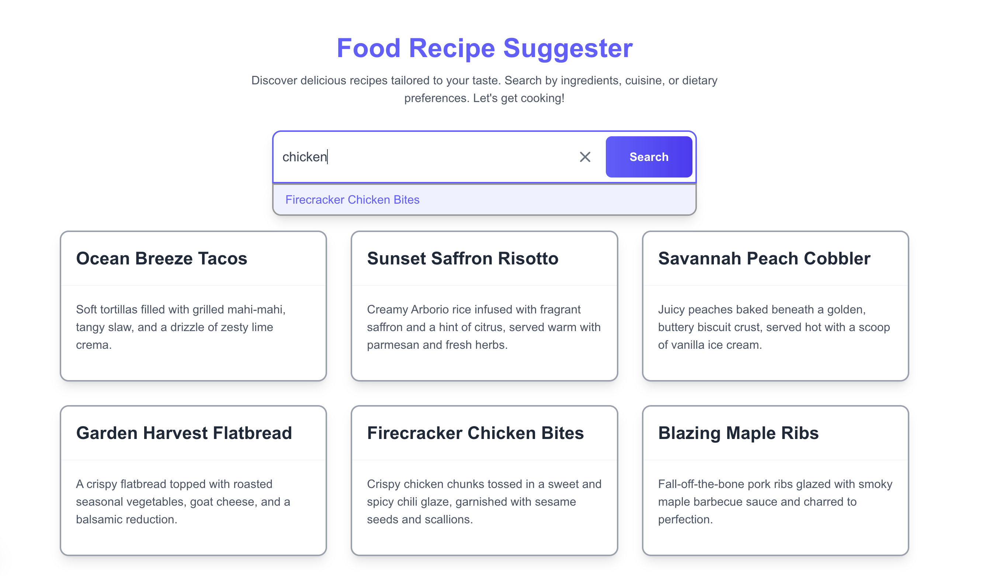

# Smart URL-Based Search (URL-Smart-Search)



A powerful full-stack intelligent search application implementation using **Next.js App Router**, **MongoDB Atlas**, **OpenAI Embeddings**, **Autocomplete**, **Fuzzy Matching**, and **Retrieval-Augmented Generation (RAG)** concepts. This project demonstrates how to build an intelligent and shareable semantic search experience that integrates modern UX features and advanced backend capabilities.

## 📦 Tech Stack

| Layer       | Technology                                                                                                                 |
| ----------- | -------------------------------------------------------------------------------------------------------------------------- |
| Framework   | Next.js 15 (App Router, React Server/Client Components, Suspense)                                                          |
| Database    | MongoDB Atlas (full-text, vector, autocomplete)                                                                            |
| ORM         | Prisma (`@prisma/client`)                                                                                                  |
| Embeddings  | OpenAI (`text-embedding-3-small`)                                                                                          |
| Styling     | Tailwind CSS                                                                                                               |
| Language    | TypeScript                                                                                                                 |
| UX Features | Autocomplete, Full-Text Search, Fuzzy Matching, Semantic Search with Vectors, Debounced Input, URL-based query persistence |

## ✨ Features

### ✅ URL-Based Search State

- Search queries are stored in the URL using `searchParams`.
- Enables bookmarking and sharing direct links to filtered content.
- No local component state for search terms – driven by URL for maximum transparency and reproducibility.

### ⚡ Instant Autocomplete

- Live suggestions shown as you type.
- Powered by MongoDB’s Atlas Search with `autocomplete` index on recipe titles.
- Debounced input handling to avoid spamming backend requests.

### 🧠 Semantic Search with Vector Embeddings (RAG)

- Queries and documents embedded using OpenAI's `text-embedding-3-small` model.
- Embeddings stored directly in MongoDB.
- Enables concept-level matching (e.g., "I want fast food" returns recipes with Burger).
- MongoDB Atlas vector search index used for fast KNN-based retrieval.

### 📝 Fuzzy Full-Text Search

- Tolerant to typos (e.g., "chikn" → "chicken").
- Custom `fuzzy` settings with MongoDB’s `$search` aggregation.
- Prioritized by relevance scoring.

### 🚀 Fast UX with Suspense + Loading States

- Optimized Server/Client component split.
- Suspense-wrapped recipe list enables built-in loading UI.
- Key-based rerendering ensures fresh data on new searches.

## 📂 Project Structure

```bash
src/
├── app/                 # App Router structure
│   ├── api/autocomplete/route.ts  # API route for autocomplete suggestions
│   ├── globals.css      # Global styles
│   ├── layout.tsx
│   ├── page.tsx
├── components/          # Reusable UI components
│   ├── AutoCompleteBox.tsx
│   ├── loading.tsx
│   ├── recipeList.tsx
│   └── searchBar.tsx
├── hooks/               # Custom React hooks
│   ├── useClickOutside.ts
│   └── useDebounce.ts
├── lib/                 # Shared utilities
│   ├── db.ts            # Prisma client instance
│   └── embeddings.ts    # OpenAI embed helper
├── prisma/
│   ├── schema.prisma    # MongoDB schema for Prisma
│   └── seed.ts          # Initial data seeder
├── scripts/
│   └── generate-embeddings.ts  # Populate vector embeddings
...
```

## 🛠️ Setup Instructions

1. **Clone repo & install dependencies:**

   ```bash
    git clone https://github.com/faridvatani/url-smart-search
    cd url-smart-search
    pnpm install
   ```

2. **Configure environment:**

- Create a `.env` file in the root directory and add your MongoDB connection string and OpenAI API key:

  ```bash
  NODE_ENV=development #development or production
  DATABASE_URL="mongodb+srv://<username>:<password>@cluster.mongodb.net/mydatabase?retryWrites=true&w=majority"
  OPENAI_API_KEY="your-openai-api-key"
  ```

3. **Push Prisma schema to MongoDB:**

   ```bash
   npx prisma db push
   ```

4. **Seed the database with sample data:**

   ```bash
   pnpm seed
   ```

5. **Generate vector embeddings for the recipes:**

   ```bash
   pnpm embed
   ```

6. **Run the development server:**
   ```bash
   pnpm dev
   ```
   > 💡 Note: Ensure MongoDB Atlas indexes are set up: full-text, vector (embeddings), and autocomplete (on title).

## 📜 Scripts

| Script  | Description                       |
| ------- | --------------------------------- |
| `dev`   | Start local server with Turbopack |
| `build` | Build for production              |
| `seed`  | Seed MongoDB with recipe data     |
| `embed` | Generate OpenAI vector embeddings |
| `lint`  | Run ESLint checks                 |

## 🧪 Example Queries

- `"chikn"` → Firecracker Chicken Bites (fuzzy)
- `"I want something sweet today"` → Savannah Peach Cobbler recipes (semantic)
- `"Valentine's Day"` → Chocolate Lava Cake (semantic + seasonal)
- `"choco"` (while typing) → autocomplete: "Chocolate Lava Cake", "Coconut Cloud Pudding"

## 📣 Credit

Built with ❤️ by [Farid Vatani](https://github.com/faridvatani).

## 🧠 Wiki

Check out the [Wiki](https://github.com/faridvatani/url-smart-search/wiki) for detailed explanations of the implementation, including how to set up MongoDB Atlas, Prisma, and OpenAI API keys.

## 📎 Learn More

To learn more about Next.js, take a look at the following resources:

- [Next.js Documentation](https://nextjs.org/docs) - learn about Next.js features and API.
- [Learn Next.js](https://nextjs.org/learn) - an interactive Next.js tutorial.

You can check out [the Next.js GitHub repository](https://github.com/vercel/next.js) - your feedback and contributions are welcome!

## 🚀 Deploy on Vercel

The easiest way to deploy your Next.js app is to use the [Vercel Platform](https://vercel.com/new?utm_medium=default-template&filter=next.js&utm_source=create-next-app&utm_campaign=create-next-app-readme) from the creators of Next.js.

Check out our [Next.js deployment documentation](https://nextjs.org/docs/app/building-your-application/deploying) for more details.

## 📝 License

This project is licensed under the MIT License. See the [LICENSE](LICENSE) file for details.
